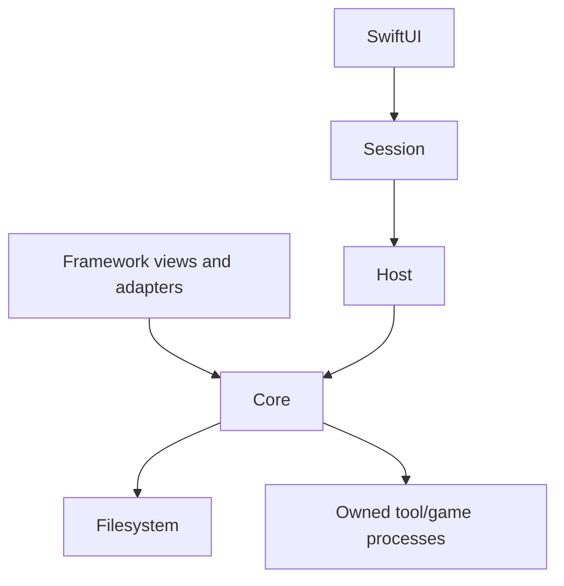
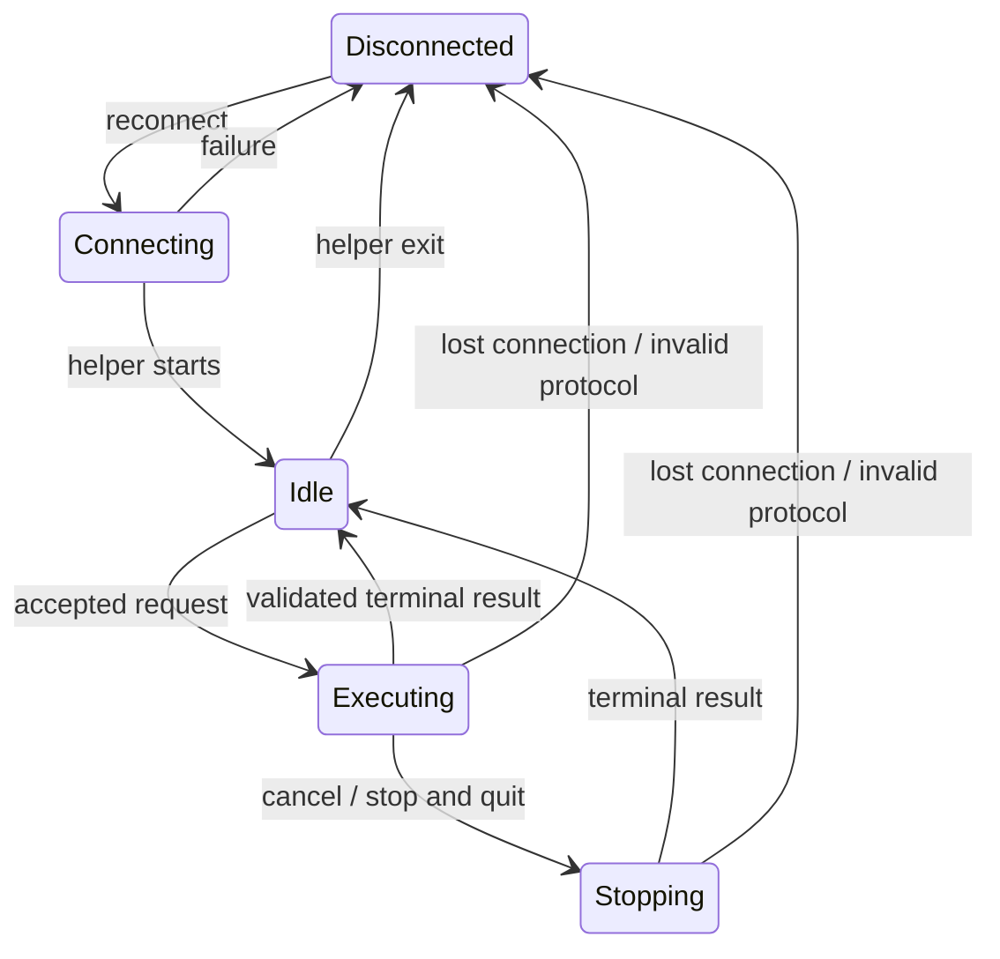

# Dependencies and session control

The dependencies form a DAG. Session transitions cycle as operations finish; this does not introduce a dependency cycle.

Core's mod layer owns detection, planning, staged preparation, and recovery. Core's product workflow owns native launch order. Host owns framing, the operation gate, and the pending launch-choice callback. UI decisions travel as callback results, not dependencies from Core to a frontend.

## Session state

`SessionControl` owns a single state: disconnected, connecting, idle, executing, or stopping. An executing/stopping operation is either a regular request or a launch carrying a launch phase. Only a launch can await a patch choice. Request context captures identity, command, domain, product, catalog query/page, and feedback intent.

A launch progresses through checking → preparing → publishing → starting → running. Checking may instead await Delete/Keep; submission becomes a local choice-submitted phase until Host resumes preparation. Vanilla and retained-patches launches may skip preparation/publication. Failure/cancellation terminates the operation from any phase. A control acknowledgement never completes the underlying operation.

- `busy`, connection state, catalog activity, pending prompt, and Stop availability are derived, not independent writable flags.
- Loaded data and its unavailable/loading/loaded/failed status are separate from operation state. Rejected requests do not change data or catalog pagination. Settings remain confirmed values until a successful response; views own drafts.
- A small deduplicated queue holds follow-up reads only. User mutations never queue. Stop and Quit clears that queue and waits for the helper to exit, including after connection loss.
- Responses are correlated to the active request or a pending control request. Invalid shapes, unknown IDs, or invalid launch transitions disconnect and invalidate readiness. Old reader generations cannot update a reconnected session.
- Backend checks remain authoritative when cached UI state is stale or another client sends protocol requests directly.

## Patch transaction boundaries

Staging leaves the active patch tree untouched. Before renaming directories, Core durably writes a transaction record outside the package; staging and backup directories are beside the target. Publication and rollback form a non-cancellable barrier. Cancellation after a successful commit prevents starting the game but does not invalidate the new patch set.

An unresolved publication record blocks RR package/patch changes and launch. No automatic recovery occurs after process death. Explicit restoration copies from the preserved backup and records completion before cleanup, so failed restoration can be retried. If a previous target did not exist, restoration returns to that absence. Missing/ambiguous evidence stays blocked and is preserved for inspection.

These guarantees cover application failures and interrupted helper processes. The transaction does not claim protection against arbitrary external edits or physical storage failure. Existing product-build publication remains its separate workflow.

## Verification

Run `./macos/Native/test_session.sh` for reducer and actual response-handler tests. Run the Core/framework suites and `python3 macos/Native/test_bridge.py` as documented in README. The bridge tests use the bundled helper, temporary roots, local catalog fixtures and fake game executables; real in-game acceptance is recorded separately in ACCEPTANCE.md.
